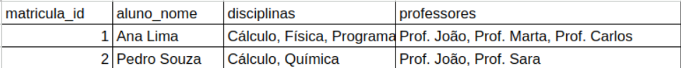
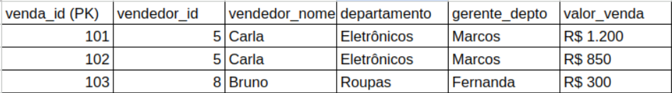
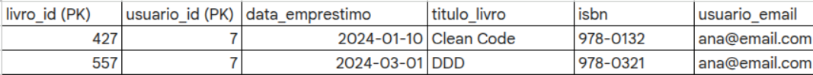
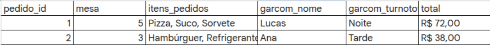

# Atividade 08 — Normalização de Dados e Arquitetura de Software

## Objetivo

Aplicar os conceitos de Primeira, Segunda e Terceira Forma Normal (1FN, 2FN e 3FN) por meio da análise de diferentes cenários, identificando problemas de modelagem e propondo estruturas de banco de dados normalizadas.

## Estrutura da atividade

Cada exercício contém:

- tabela proposta no enunciado;
- respostas às tarefas solicitadas;
- diagrama relacional desenvolvido em DBML;
- imagem do diagrama gerada no [dbdiagram.io](https://dbdiagram.io/home).

As figuras utilizadas como base para os exercícios encontram-se disponíveis na pasta `anexos/`.

## Organização dos arquivos

```text
docs/
└── atv_08-banco-de-dados/
    ├── README.md
    ├── anexos/
    │   ├── figura-01-matriculas.png
    │   ├── figura-02-vendas.png
    │   ├── figura-03-restaurante.png
    │   └── figura-04-biblioteca.png
    ├── exercicio-01/
    │   ├── diagrama.dbml
    │   └── diagrama.png
    ├── exercicio-02/
    │   ├── diagrama.dbml
    │   └── diagrama.png
    ├── exercicio-03/
    │   ├── diagrama.dbml
    │   └── diagrama.png
    ├── exercicio-04/
    │   ├── diagrama.dbml
    │   └── diagrama.png
    └── exercicio-05/
        ├── diagrama.dbml
        └── diagrama.png
```

## Índice

- [Exercício 1 — Diagnóstico da 1FN](#exercício-1--diagnóstico-da-1fn)
- [Exercício 2 — Diagnóstico da 3FN](#exercício-2--diagnóstico-da-3fn)
- [Exercício 3 — Sistema de Restaurante](#exercício-3--sistema-de-restaurante)
- [Exercício 4 — Gestão de Biblioteca](#exercício-4--gestão-de-biblioteca)
- [Exercício 5 — Sistema de Clínica](#exercício-5--sistema-de-clínica)
- [Conclusão](#conclusão)

---

# Exercício 1 — Diagnóstico da 1FN

## Tabela proposta



## Objetivo

Aplicar a Primeira Forma Normal (1FN) na tabela de matrículas, eliminando atributos multivalorados e garantindo que cada campo armazene apenas um único valor.

### Tarefa A — Identifique a regra da 1FN que está sendo violada.

A tabela viola a Primeira Forma Normal (1FN), pois os campos **disciplinas** e **professores** armazenam múltiplos valores em uma única célula.

### Tarefa B — O que define um atributo como "atômico" e por que as colunas acima falham nesse quesito?

Um atributo é considerado atômico quando armazena apenas um único valor por registro.

Na tabela apresentada, os campos **disciplinas** e **professores** agrupam vários valores separados por vírgula, impossibilitando que cada informação seja manipulada individualmente.

### Tarefa C — Reescreva a tabela normalizada. Quantas linhas a ficha da aluna Ana Lima terá ao final?

Após aplicar a 1FN, cada disciplina passa a ser representada por um registro independente.

A ficha da aluna **Ana Lima** passa a possuir **3 linhas**, uma para cada disciplina cursada.

A estrutura normalizada foi representada por meio das entidades:

- Aluno;
- Disciplina;
- Professor;
- Matrícula.

### Diagrama

- Código-fonte: `exercicio-01/diagrama.dbml`
- Imagem: `exercicio-01/diagrama.png`

---

# Exercício 2 — Diagnóstico da 3FN

## Tabela proposta



## Objetivo

Identificar dependências transitivas e reorganizar a estrutura da tabela conforme a Terceira Forma Normal (3FN).

### Tarefa A — Mapeie a cadeia de dependências. O que determina o quê?

A cadeia de dependências identificada é:

```text
Venda
→ Vendedor
→ Departamento
→ Gerente
```

Ou seja:

- `venda_id` determina o vendedor responsável;
- o vendedor pertence a um departamento;
- o departamento determina o gerente.

Dessa forma, o gerente depende do departamento e não diretamente da venda.

### Tarefa B — Qual é o problema prático de manter o nome do gerente atrelado à venda se o gerente de "Eletrônicos" for substituído?

Caso o gerente do departamento de Eletrônicos seja substituído, todas as vendas já registradas para esse departamento precisariam ser atualizadas.

Essa redundância aumenta o risco de inconsistências e caracteriza uma anomalia de atualização.

### Tarefa C — Proponha o schema final separado em 3 tabelas.

O modelo foi dividido nas seguintes entidades:

- Departamento;
- Vendedor;
- Venda.

Essa separação elimina a dependência transitiva, centralizando as informações do departamento e do gerente em um único local.

### Diagrama

- Código-fonte: `exercicio-02/diagrama.dbml`
- Imagem: `exercicio-02/diagrama.png`

---

# Exercício 3 — Sistema de Restaurante

## Tabela proposta



## Objetivo

Aplicar sequencialmente as três Formas Normais para reduzir redundâncias e organizar corretamente as entidades do sistema.

### Passo 1 (1FN) — Corrija os atributos multivalorados.

O campo **itens_pedidos** foi normalizado para que cada item do pedido seja armazenado em um registro próprio.

Essa alteração elimina o atributo multivalorado e atende aos requisitos da Primeira Forma Normal.

### Passo 2 (2FN) — Identifique e separe as dependências parciais.

As informações do garçom (**nome** e **turno**) foram separadas em uma entidade própria, pois não dependem diretamente do pedido.

Também foi criada uma entidade para representar os produtos, evitando repetição das informações dos itens vendidos.

### Passo 3 (3FN) — Remova as dependências transitivas.

Após a separação das entidades, o modelo passou a conter:

- Garçom;
- Mesa;
- Produto;
- Pedido;
- ItemPedido.

Cada tabela passou a armazenar apenas informações diretamente relacionadas à sua chave primária, eliminando dependências transitivas.

### Desafio — O campo **total** deve ser armazenado no banco ou calculado via query?

O campo **total** deve ser calculado a partir dos itens do pedido, utilizando a soma dos produtos e suas respectivas quantidades.

Essa abordagem evita duplicação de dados e reduz a possibilidade de inconsistências caso algum preço ou quantidade seja alterado.

O armazenamento desse valor faria sentido apenas em cenários específicos, como emissão de documentos fiscais, histórico financeiro ou otimizações de desempenho.

### Diagrama

- Código-fonte: `exercicio-03/diagrama.dbml`
- Imagem: `exercicio-03/diagrama.png`

---

# Exercício 4 — Gestão de Biblioteca

## Tabela proposta



## Objetivo

Identificar dependências parciais em uma tabela que já atende à Primeira Forma Normal (1FN) e reorganizar sua estrutura conforme a Segunda Forma Normal (2FN).

### Tarefa A — Para os campos `titulo_livro` e `usuario_email`, diga se eles dependem de: apenas `livro_id`, apenas `usuario_id` ou de ambos.

As dependências identificadas são:

- `titulo_livro` depende apenas de **livro_id**;
- `usuario_email` depende apenas de **usuario_id**.

Como ambos os atributos dependem apenas de parte da chave primária composta (`livro_id`, `usuario_id`), a tabela viola a Segunda Forma Normal (2FN).

### Tarefa B — Liste uma anomalia de inserção que ocorre se tentarmos cadastrar um livro novo que ainda não foi emprestado a ninguém.

No modelo original, não é possível cadastrar um novo livro sem associá-lo a um empréstimo.

Isso ocorre porque as informações do livro estão vinculadas diretamente ao registro de empréstimo, dificultando o cadastro independente do acervo.

### Tarefa C — Desenhe o schema final normalizado.

O modelo foi dividido nas seguintes entidades:

- Livro;
- Usuário;
- Empréstimo.

Essa separação elimina as dependências parciais e permite que livros e usuários sejam cadastrados independentemente da existência de empréstimos.

### Diagrama

- Código-fonte: `exercicio-04/diagrama.dbml`
- Imagem: `exercicio-04/diagrama.png`

---

# Exercício 5 — Sistema de Clínica

## Estrutura proposta

```text
consulta_id
paciente_nome
paciente_cpf
plano_saude
plano_cobertura
medico_nome
medico_crm
especialidade
sala_numero
sala_andar
procedimentos
```

## Objetivo

Normalizar uma estrutura completamente desnormalizada até atingir a Terceira Forma Normal (3FN), organizando corretamente as entidades e seus relacionamentos.

### Tarefa 1 — Liste todas as violações encontradas, apontando qual Forma Normal está sendo ferida.

As violações identificadas foram:

- **1FN:** o campo `procedimentos` armazena múltiplos valores em um único atributo;
- **2FN:** diferentes entidades (paciente, médico, plano e sala) estão concentradas na mesma estrutura, dificultando a separação de responsabilidades;
- **3FN:** existem dependências transitivas, como:
  - o paciente determina o plano de saúde;
  - o plano determina sua cobertura;
  - o médico determina sua especialidade.

### Tarefa 2 — Proponha o conjunto de tabelas em 3FN (PKs, FKs e atributos).

O modelo foi dividido nas seguintes entidades:

- PlanoSaude;
- Paciente;
- Especialidade;
- Medico;
- Sala;
- Consulta;
- Procedimento;
- ConsultaProcedimento.

Essa organização elimina redundâncias, melhora a integridade dos dados e facilita futuras manutenções no banco de dados.

### Tarefa 3 — Se o plano "Unimed" alterar sua cobertura de 80% para 70%, em quantas tabelas você precisaria mexer no seu modelo normalizado? Comparado ao modelo original, qual a vantagem?

No modelo normalizado, a alteração é realizada apenas na tabela **PlanoSaude**.

No modelo original, essa informação estaria repetida em diversos registros de consultas, exigindo múltiplas atualizações e aumentando o risco de inconsistências.

A principal vantagem da normalização é manter cada informação armazenada em um único local, simplificando a manutenção e preservando a consistência dos dados.

### Diagrama

- Código-fonte: `exercicio-05/diagrama.dbml`
- Imagem: `exercicio-05/diagrama.png`

---

# Conclusão

A atividade permitiu aplicar, de forma prática, os conceitos de Primeira, Segunda e Terceira Forma Normal em diferentes cenários de modelagem de dados.

Ao longo dos exercícios, foi possível identificar problemas como atributos multivalorados, dependências parciais e dependências transitivas, propondo estruturas mais organizadas e consistentes para cada contexto.

A utilização do DBML e do [dbdiagram.io](https://dbdiagram.io/home) complementou a atividade ao permitir representar visualmente os modelos normalizados, facilitando a compreensão dos relacionamentos entre as entidades e das decisões de modelagem adotadas.

Como resultado, os modelos finais reduzem redundâncias, evitam anomalias de inserção, atualização e exclusão, além de oferecer uma estrutura mais simples de manter e expandir em cenários reais de desenvolvimento.